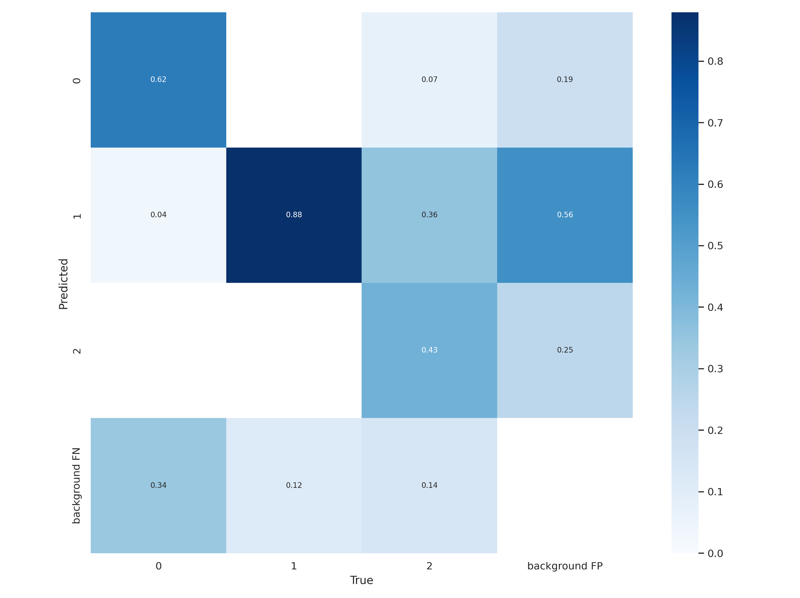

<h1 align="center"><b>Real Time Face Mask Detection</b></h1>

### Real time facemask detection using yolov5 which is able to detect No-Mask, Improper-Mask and Mask.
- Implementation of System to Detect Face Mask
- Detecting Using Real-Time and Video Feed from the system
- Based on the Yolo5 Object Detection Algorithm
- YOLO: You Only Look Once Version 5
- Able to detect a person wearing a mask or not and also improper wearing
- Trained Model with dataset containing 853 Images
- Achived Accuracy of 0.85@MAP




## How to Run
- To run this project install required libraries using requirements.txt file
```
pip install -r requirements.txt
```
- To start web server run Main.py file:
``` 
python Main.py
```
- To run only detection use detect_face_mask.py
```
python detect_face_mask.py
```
- To train the Model use train_model.ipynb file inside model folder

## Screenshots
### Web Interface
#### 1. Login Page

#### 2. User Home

### Detection From Video
#### 1.

#### 2.

#### 3.

### Detection From Web Camera
#### 1. No-Mask

#### 2. Improper-Mask

#### 3. Mask


